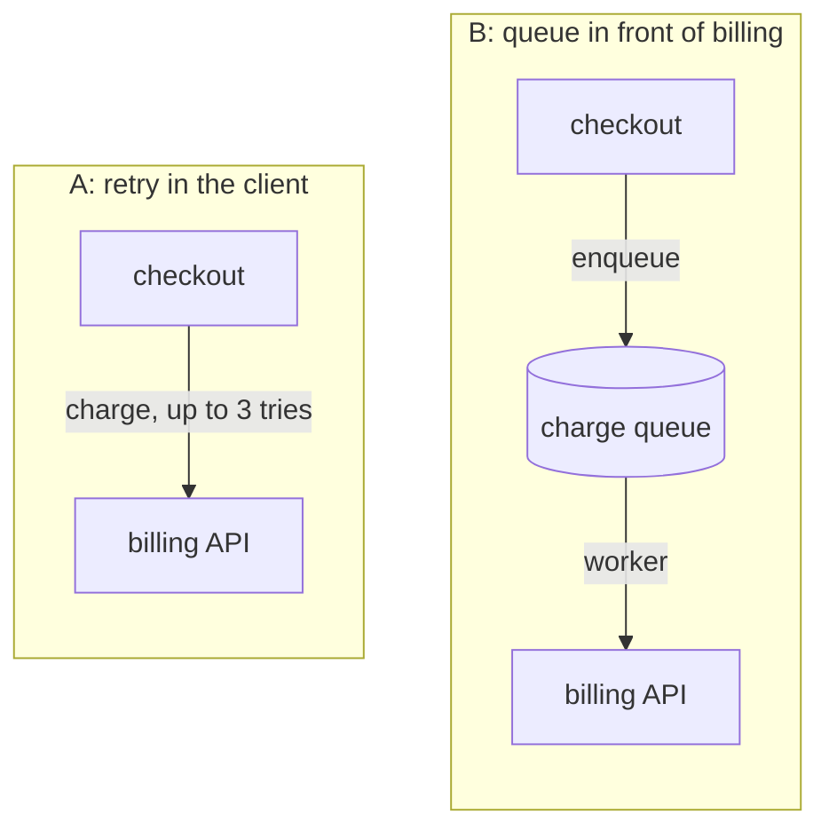
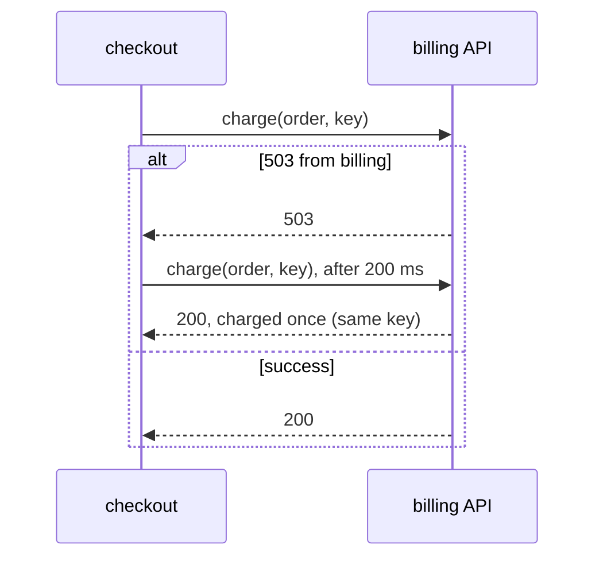
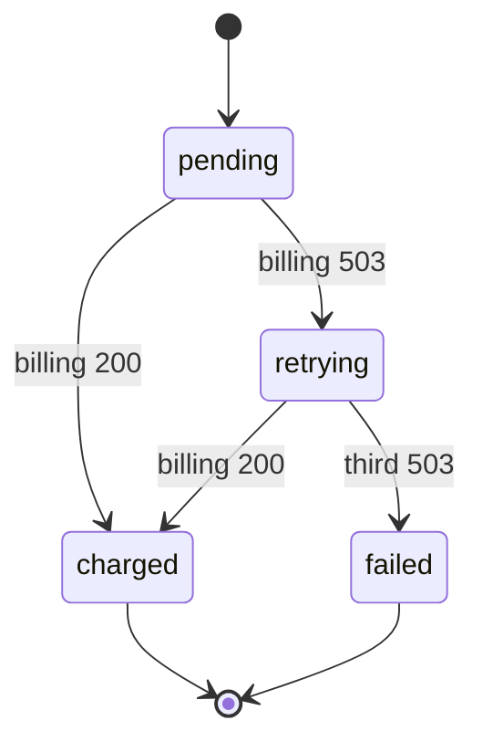
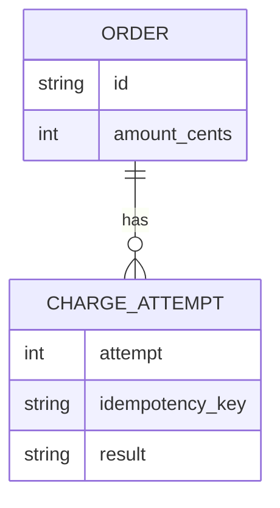

# sketch

A picture earns its place when the answer is a shape: where something sits,
who calls whom, what state a thing is in, how data relates. Requirements,
trade-off lists and yes-or-no questions stay in words, even on a UI topic:
"what should this page say" is a text question, "which of these two layouts"
is a picture.

Draw in Mermaid, inside the design file or the reply. It renders on GitHub,
GitLab and in most editors, it diffs like code, and `spec_check.py` lints it.
Where nothing renders it, the source still reads as text.

## Rules

- One question per diagram, and ask it under the picture: "A or B?"
- Twelve nodes or fewer. More means two diagrams, or a design to split.
- Label with the words the design uses. A box the prose never names is a
  question the reader cannot ask.
- Options side by side are drawn at the same detail, or the plainer one looks
  worse for no reason. Link the option subgraphs with an invisible `A ~~~ B`
  and give each `direction TB`: unlinked, Mermaid stacks them in any order.
- The diagram replaces prose, not repeats it: cut the paragraph it draws.

## Which diagram

| The question | Diagram |
| --- | --- |
| Where should this sit? Which of these structures? | `flowchart` with one `subgraph` per option |
| Who calls whom, in what order, and what happens on failure? | `sequenceDiagram` with an `alt` block |
| What states can it be in, and what moves it between them? | `stateDiagram-v2` |
| What data is stored, and how does it relate? | `erDiagram` |
| What goes where on the screen? | An ASCII box sketch: Mermaid lays out graphs, not pages |

### Options side by side



A or B? A is one file and a flag; B survives a long outage but adds a queue
to run.

### Calls in order, with the failure path



### States and what moves between them



### Data and how it relates



### A screen layout

```text
A: list beside detail            B: detail opens over the list
+----------+-----------------+   +----------------------------+
| invoices | invoice #1042   |   | invoices                   |
| #1042  > | amount, status, |   |  +----------------------+  |
| #1041    | retry button    |   |  | invoice #1042    [x] |  |
+----------+-----------------+   +--+----------------------+--+
```

A or B?

## Done when

Each picture answers one question, the question is asked under it, and
`spec_check.py` reports no Mermaid errors in the file.
